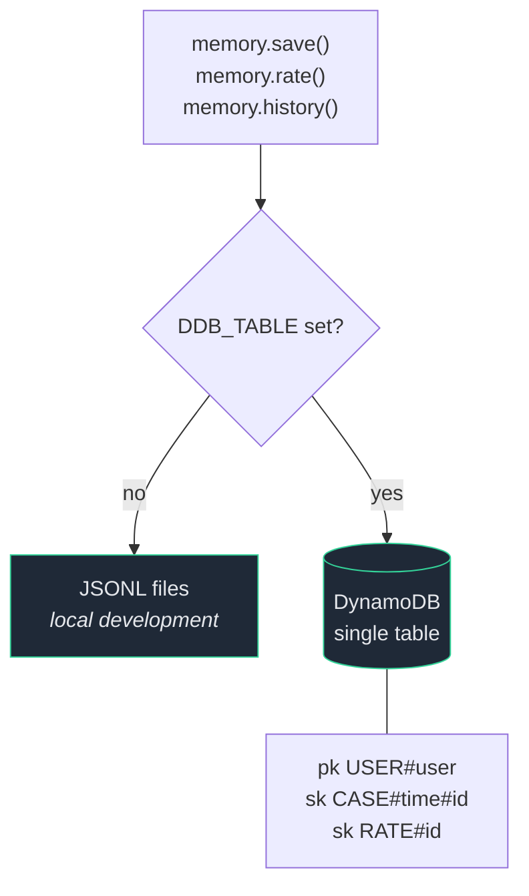
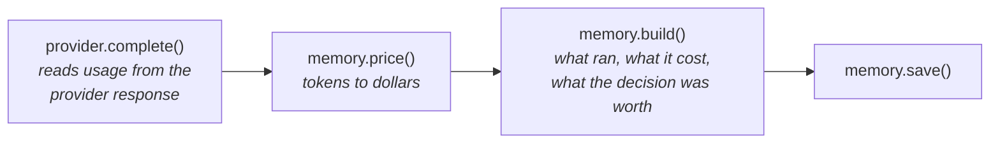
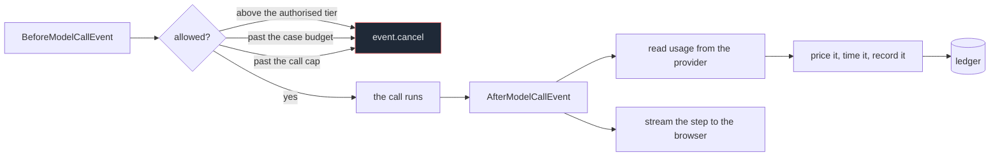

# Architecture

## The team

A case officer coordinates four specialists. Each specialist is its own Strands
agent with one job and one system prompt, exposed to the case officer as a tool.

The forensics agent is the only one that runs outside a request, on a schedule,
so it never adds delay to anything a person is waiting for.

## Choosing a tier

Four tiers, and the decision is deliberately biased upward. Sending easy work to
a big model wastes a fraction of a cent. Sending hard work to a small model
produces a confident wrong answer that somebody acts on, and no ledger records
that cost.

Two safety properties fall out of this. The keyword fallback never escalates to
the top tier, so a parse failure can never turn into an expensive call. And the
only automatic tier change moves upward, because a cheap answer somebody
rejected was never a saving.

## Storage

One interface, two backends, selected by whether `DDB_TABLE` is set. Nothing
above this line knows which one is in use.

One partition per user, cases and ratings stored together underneath it, so
reading a person's whole history is a single query rather than a scan.

## Where the money is counted

Tokens enter the system through exactly one door. If a number is wrong, it is
wrong in one of these four functions and nowhere else.

No number in the ledger is estimated by a model.

## One entry point, two lanes

`pipeline.run` is the only way in. It classifies the request, applies the
approval rule, picks a lane, and records the result.

| Lane | What runs | When |
|---|---|---|
| solo | one Strands agent, no tools | formulaic work, most traffic |
| team | a coordinator with four specialists as tools | judgement work, or high risk |

Both lanes are Strands agents wired to the same hooks, so the ledger, the
approval gate, the spend budget and the loop cap apply identically. The lane
only decides how many heads look at the problem, never whether the controls
run.

An earlier version had a second, agent-free path for speed. It was faster
because it was doing less than anyone believed, and nothing it did was
recorded the same way.

## What the hooks do

Everything that matters happens in `src/bureau.py`, in two Strands hooks that
fire on every model call any agent makes.

A supervisor told in its prompt to ask permission first is making a request,
and a model can talk itself out of a request. A hook that sets `event.cancel`
is a control, and the model is not consulted.

Three things can stop a call: a tier above what the owner authorised, a case
that has spent its budget, and a case past its call cap. The last one exists
because local models are free, so a dollar budget never fires on Ollama, and a
small model calling tools in circles is exactly the local failure.

## A case is a conversation

One case is one session. Turns accumulate under a single case id, and the
agent facing the person carries a Strands `FileSessionManager`, so it sees
what was already said.

History cannot grow without bound, so a `SummarizingConversationManager`
compresses the older part of it. Its summarising agent is one of ours, on the
cheapest tier, wired to the same hooks. The cost of compressing therefore sits
in the ledger next to the cost it saves, which is the only way that trade can
be checked.

Only the agent facing the person carries a session. The specialists it calls
are stateless on purpose: they answer one question about one request, and
shared history would blur whose turn is whose.

## Local and deployed

One switch, `USE_AWS`. Off, every agent runs on Ollama and costs nothing. On,
every agent runs on Bedrock. The tiers, the ledger, the gate and the prices
used for accounting do not move; only the model behind each tier does.

Locally the coordinator is the only agent that calls tools, and small models
are unreliable at that, so `OLLAMA_MID` is the setting worth raising if the
team lane misbehaves.

Adding a provider is a code change, in `src/config.py`, on purpose. It is the
one place that decides what the system can reach, and a running instance
should not be able to point itself somewhere new from a web form.

## What gets measured

The ledger records money and time, and deliberately not what anybody wrote.

| Recorded | Where it comes from |
|---|---|
| tokens in and out | the provider's own usage response |
| cost | those tokens at the catalogue rate |
| baseline cost | the same tokens priced on the tier the person would otherwise have opened |
| seconds | wall clock, per call and per turn |
| calls | how many model calls the turn took, agents included |
| adapted | whether the prompt was fitted to the tier answering |

`memory.quality` joins that to the ratings and reports **cost per accepted
answer**: spend divided by the answers somebody actually took. A cheap tier
rejected three times in four costs the same per useful answer as a mid tier
that lands every time, while looking four times cheaper on any bill. A bill
cannot see a rejection.
