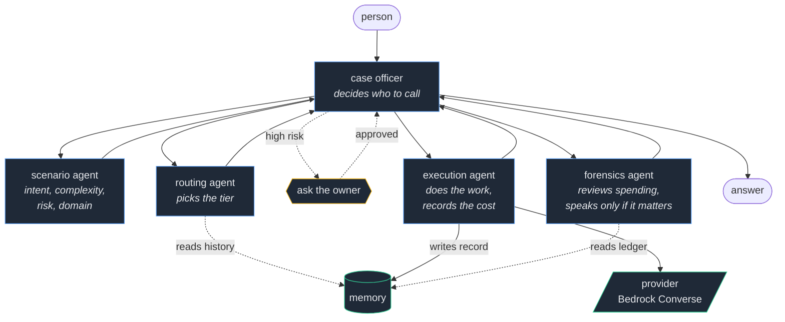
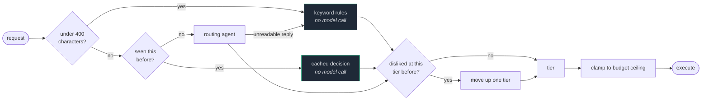
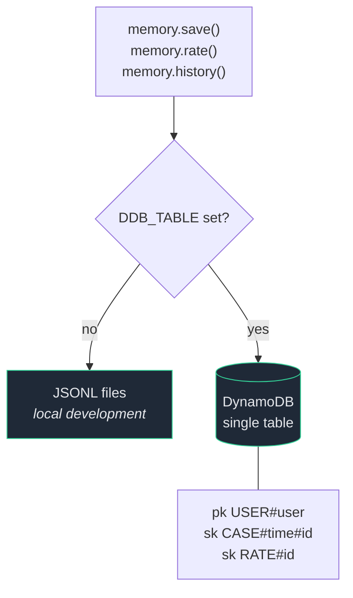
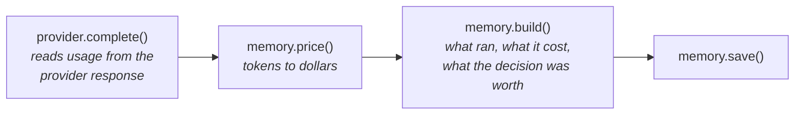

# Architecture

## The team

A case officer coordinates four specialists. Each specialist is its own Strands
agent with one job and one system prompt, exposed to the case officer as a tool.

The forensics agent is the only one that runs outside a request, on a schedule,
so it never adds delay to anything a person is waiting for.

## Choosing a tier

Four tiers, and the decision is deliberately biased upward. Sending easy work to
a big model wastes a fraction of a cent. Sending hard work to a small model
produces a confident wrong answer that somebody acts on, and no ledger records
that cost.

Two safety properties fall out of this. The keyword fallback never escalates to
the top tier, so a parse failure can never turn into an expensive call. And the
only automatic tier change moves upward, because a cheap answer somebody
rejected was never a saving.

## Storage

One interface, two backends, selected by whether `DDB_TABLE` is set. Nothing
above this line knows which one is in use.

One partition per user, cases and ratings stored together underneath it, so
reading a person's whole history is a single query rather than a scan.

## Where the money is counted

Tokens enter the system through exactly one door. If a number is wrong, it is
wrong in one of these four functions and nowhere else.

No number in the ledger is estimated by a model.

## One entry point, two lanes

`pipeline.run` is the only way in. It classifies the request, applies the
approval rule, picks a lane, and records the result.

| Lane | What runs | When |
|---|---|---|
| solo | one Strands agent, no tools | formulaic work, most traffic |
| team | a coordinator with four specialists as tools | judgement work, or high risk |

Both lanes are Strands agents wired to the same hooks, so the ledger, the
approval gate, the spend budget and the loop cap apply identically. The lane
only decides how many heads look at the problem, never whether the controls
run.

An earlier version had a second, agent-free path for speed. It was faster
because it was doing less than anyone believed, and nothing it did was
recorded the same way.

## Local and deployed

One switch, `USE_AWS`. Off, every agent runs on Ollama and costs nothing. On,
every agent runs on Bedrock. The tiers, the ledger, the gate and the prices
used for accounting do not move; only the model behind each tier does.

Locally the coordinator is the only agent that calls tools, and small models
are unreliable at that, so `OLLAMA_MID` is the setting worth raising if the
team lane misbehaves.
