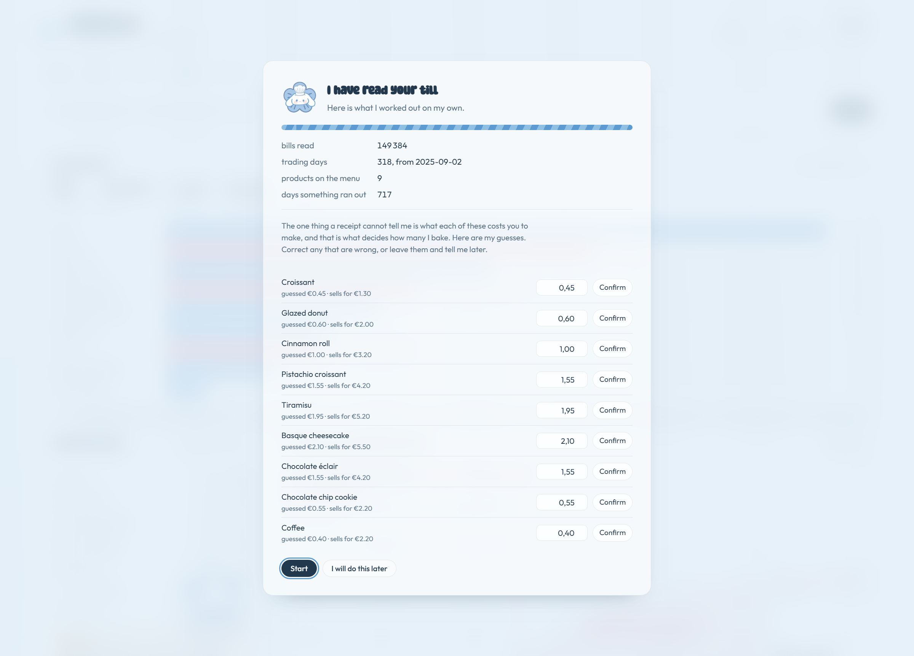
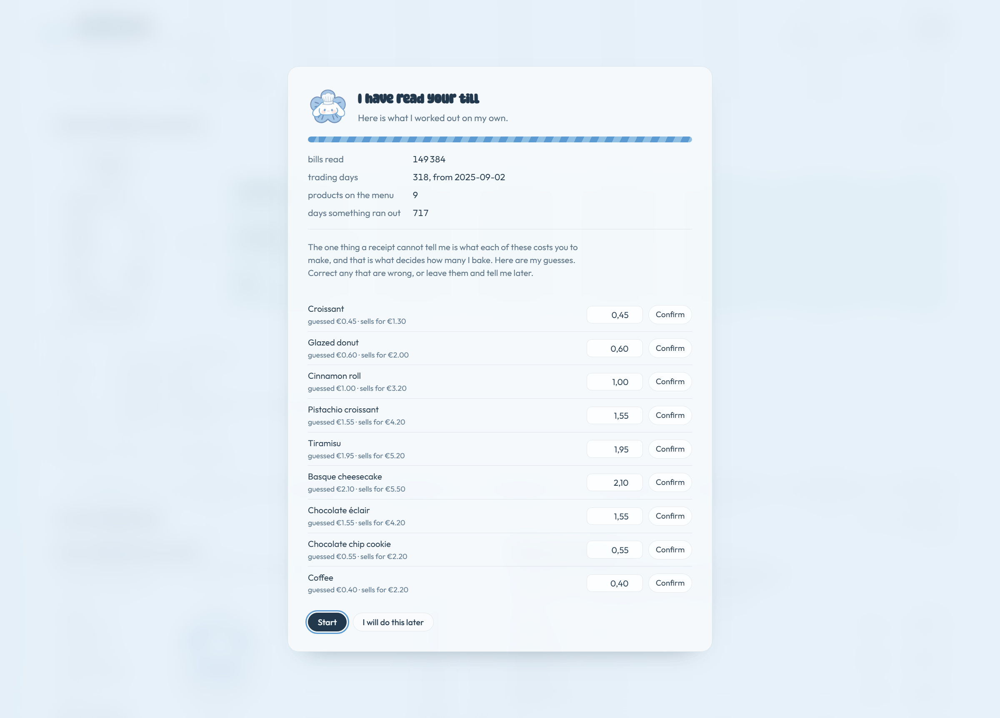
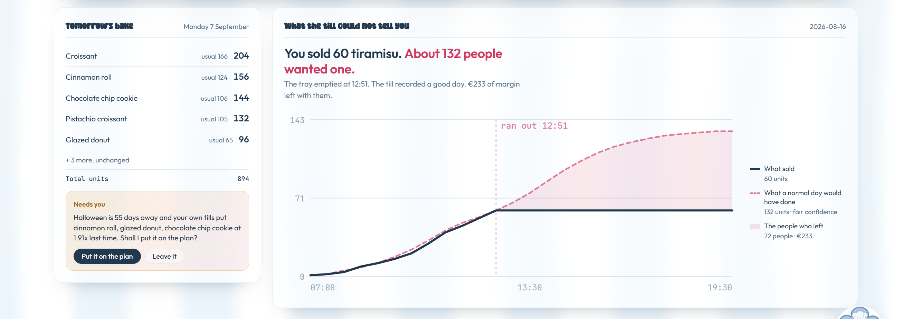
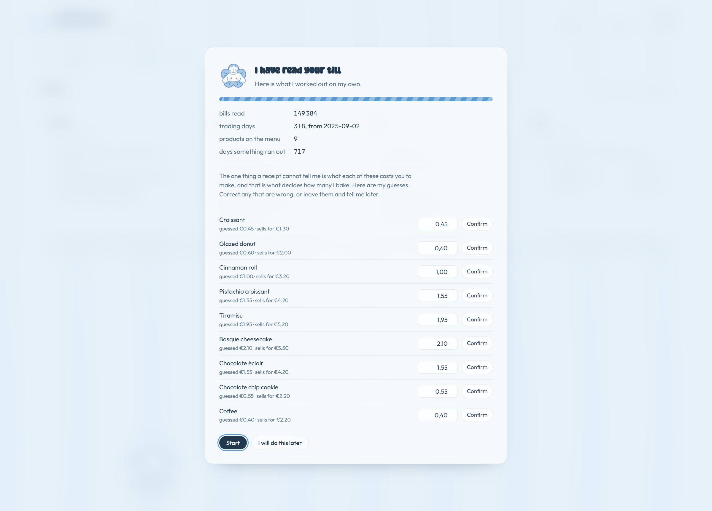
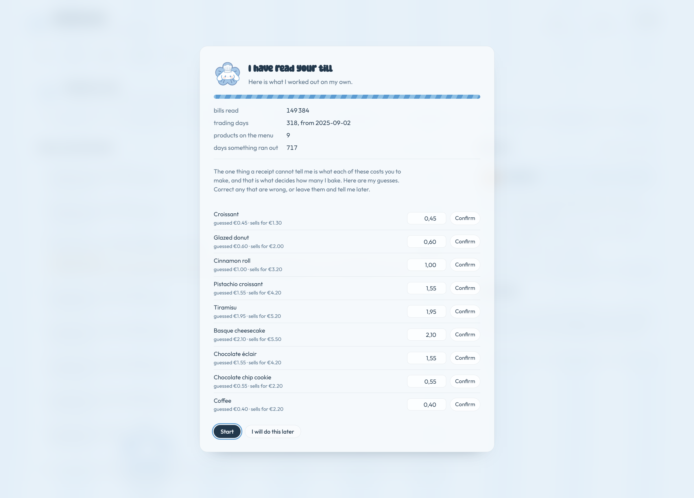

# Sonnabon

**Operations and planning, for small bakeries.**

A bakery owner does about **seven hours of admin a week** that nobody trained
them for, at the end of days that are already too long. Sonnabon does it
instead, and asks for them only when something genuinely needs a person.

| Every | What it takes off you | By hand |
|---|---|---|
| Close of trade | Read the day's bills and work out what ran out | 2.0 h a week |
| Close of trade | Decide tomorrow's production, product by product | 3.5 h a week |
| Supplier cutoff | Work back to ingredients and raise the orders | 1.0 h a week |
| Sunday | Review what is growing and dying, look four weeks ahead | 0.75 h a week |

The last row is the one that matters most, because it is the one that never
happens. There is no evening left for it.

Point it at the till once. From then on it decides tomorrow's production, orders
the ingredients, holds the calendar, gives each person their list, and emails
the owner only when there is a decision to make.



## The three burdens, plainly

**The time.** Deciding tomorrow's production and placing the orders is roughly
an hour a day, at the end of a seventeen hour one. It happens after close,
tired, from memory.

**The maths that never gets done.** How much of each thing to make is a real
calculation. No small shop does it, because there is no hour to sit down with
the numbers and nobody was ever taught which numbers to look at.

**The planning that gets left too late.** Christmas needs flour ordered three
weeks out and a trial batch two weeks before that. A shop deciding tonight's
bake at twenty to nine is not also thinking about October, so occasions arrive
three days early with an apology.

## Setting it up is one kind of question, asked once

Everything about the shop comes off the receipts. Names, prices, how fast each
thing sells, what ran out and when. Nothing is typed in.

The one thing a receipt cannot say is what something cost to make, and cost is
what decides how much gets baked. So Sonnabon guesses from a single food cost
ratio, marks every guess, and asks about those and nothing else. Correct one and
the service level moves while you watch.

**That list is the whole setup.** A few questions the data actually raised,
rather than a form.



## Why the maths is harder than it looks

A till records what left the shelf. It cannot record what somebody wanted and
did not find.

So a day where the tiramisu sold out at 12:51 looks, in the data, like a good
day: sixty sold, nothing left over. About a hundred and thirty-two people wanted
one. The other seventy-two are not in the file anywhere.

That matters because every forecast is built on that file. Trained on sales, a
forecast learns to under-bake, and it gets worse every year: less made, sells
out sooner, records an even lower number.

**The timestamps are the way out.** A product that stops selling dead while
everything else keeps going has run out, and that is provable from data the shop
already has. Sonnabon learns each product's normal shape through the day from
days it did not run out, then on a day it did, works out how far through that
shape it got and scales up.

Everything downstream reads that corrected history, never the raw sales.



It is also why occasion lifts are measured off corrected demand rather than off
sales. Measured off the till, Christmas looks like a 1.6x week. Measured off
what people actually wanted, it is 3.8x. A shop planning from the till would
under-bake Christmas by more than half, and the till would report a triumph.

## The work goes to people, not into a report



The board splits the night's work by who starts when. The person on the counter
gets one job: confirm what ran out. Sonnabon inferred it from the timestamps and
says so; only somebody standing there can settle it, and their tick makes the
next forecast better.

## You can see what it did while you were not looking



Every time it wakes it writes a line, including the quiet ones. **It speaks on 8
nights in 30 and handles the other 22 alone.** A run earns an email by being
unusual for this shop, not by clearing a fixed number every shop clears most
days, and a late task is raised once rather than once a night.

That ratio is the product, so it is on the page rather than in a sentence.

## How we know any of it works

These are not the pitch. They are the reason the pitch is allowed to exist.

The shop in `data/` is generated, and that is deliberate. **No real till can say
how many people wanted something and left**, so no real dataset can score a
sell-out estimate. Here demand is known, because it was generated first and then
served out of a limited tray.

| | |
|---|---|
| Sell-out detection | 91% precision, 80% recall |
| Demand estimate | 3.0% median error, within 20% on 99% of 649 days |
| History needed | Three weeks. 94% precision on 18 trading days |
| Counterfactual, 120 days | Lost sales cut 56%, net cost down 10.8% |

```bash
python -m src.bakery.backtest    # replays the year and prices both plans
pytest                           # 64 tests: the maths, and the site
```

Over 120 days Sonnabon's waste goes **up**, from 9,912 to 12,579, and its lost
sales go **down from 8,321 to 3,690**. Net it saves 1,964, about 5,000 a year,
and it is better on 65 days of 120. Running out costs more than binning does,
which most owners believe the other way round.

## Run it

```bash
pip install -e .
python ui/app.py
```

Open <http://localhost:8000>. The first start generates a year and corrects it,
about thirty seconds. Every start after that is instant. Each page has its own
address, so `#diary` and `#setup` can be linked and reloaded.

The agent needs a model and will say so plainly if it has none. Two ways to give
it one, either is enough:

```bash
ollama pull qwen3                 # local, no account, works immediately
# or set AWS_REGION and credentials in .env and enable Claude in Bedrock
```

There is deliberately no scripted stand-in. A templated sentence presented as
the agent's answer would make the whole product a lie, so when there is no model
it says so. Every page keeps working; only the agent needs one.

### The look

The background is a fragment shader: vertical stripes with a slow wave through
them, which is an awning rather than a pattern. Panels are glass over it.

Sonnabon itself drifts along the bottom of the page rather than sitting in a
corner. Reaching for it stops it where it is and the panel opens there, because
a button that flies home to be clicked is a button that makes you wait.

Headings are set in **Super Bakery**, free for personal and commercial use, and
its licence ships beside it in `ui/assets/` so the repo carries its own proof.
Every figure is set in the text face instead, because a display font is lovely
on a name and unreadable on a column of numbers.

## How it is built

```
src/bakery/
  receipts.py    bills, exactly as a till prints them
  catalogue.py   the menu, learned from the receipts themselves
  generate.py    a year of trade, sell-outs on purpose, truth kept aside
  analytics.py   sell-out detection, demand estimation, trends, rankings
  plan.py        corrected history, forecast, production quantities
  calendar.py    occasions, and how far ahead each has to be started
  team.py        whose job is what, whether it is done, who confirms sell-outs
  feed.py        a trading day arriving live, one bill at a time
  journal.py     what it did and when, so the autonomy is evidence not a claim
  model.py       which provider answers, and what to do when none can
  paths.py       one shop id, every store under it, one process per bakery
  state.py       loaded once, cached on the data file's timestamp
  backtest.py    would it actually have done better
  tools.py       the thirteen things the agent can do
  agent.py       the agent, and the limits it cannot argue with
  runs.py        what happens when the clock goes off
ui/
  app.py         the demo server
  index.html     five pages, one file, no build step
```

One process serves one bakery, and that is enforced rather than hoped for:
`paths.only()` refuses a second, because the catalogue is module level and the
second shop would quietly read the first one's menu. Every store hangs off one
`SHOP_ID`, so adding a shop is a directory and two schedule entries.

The expensive step is never in a request. Building corrected history from
149,384 bills takes 24.9 seconds; reading the cache takes 0.90. So a scheduled
job builds it and everything else reads it, keyed on the receipts file's
modification time so a stale cache is impossible rather than unlikely.

Retries are safe. Each journal entry can carry a key, and it is checked before
anything is sent, so a rerun does not email twice and a task that stays overdue
is raised once rather than nightly.

**[docs/ARCHITECTURE.md](docs/ARCHITECTURE.md) has the diagram and the numbers.**

**The limits are hooks, not prompt text.** A ceiling written into a system
prompt is a request a model can talk itself out of. A hook that sets
`event.cancel` inside the agent loop is a control. Spend, looping and
irreversible actions are all gated that way.

**It reads summaries, samples, or code. Never the pile.** There are 149,384
bills. The arithmetic decides the architecture:

| Reading | Tokens | Cost per read |
|---|---|---|
| One day, raw | 31,000 | $0.09 |
| One week, raw | 196,000 | $0.59, and past the context window |
| One week, summarised | 4,000 | $0.01 |

So tools return tens of numbers rather than thousands of rows. When a summary is
not enough, `sample_bills` returns fifteen real receipts, spread across the day
or clustered around an hour, for about 200 tokens. When the question needs every
bill, `run_python` runs over all of them and returns the answer instead of the
data.

That is why a month of running Sonnabon costs a few dollars, and why the cost
per shop stays flat however long the shop has been trading.

## Pointing it at a real shop

Nothing is hard-coded to the demo bakery.

The menu is derived, not configured. On the first read of a shop whose products
it does not recognise, it learns the whole menu from the bill lines: names and
prices come straight off them, because a till already knows both. Point it at a
different bakery's export and it works out that bakery's menu with nothing typed
in. When the products are ones it already holds it keeps what it has, because a
receipt cannot carry oven times, shelf lives or salvage values and a derived
menu would flatten them.

The one thing a receipt cannot say is what an item cost to make. That comes from
a single number the owner gives once, and applied to everything it makes every
product identical, which is wrong. So Sonnabon tracks which costs it guessed and
asks about those. **That list is the whole setup conversation:** a few questions
the data actually raised, rather than a form.

Currency, data paths and limits are all environment variables. See
[`.env.example`](.env.example).

## What is honest about it

- The shop is simulated. Stated everywhere, and it is why the numbers above can
  exist at all.
- The backtest's corrections are learned from the whole file, so a little future
  leaks into the past. The forecasts themselves only read days before the one
  they plan. The tool prints this caveat rather than burying it.
- Web search returns "not configured" without an API key instead of inventing an
  event.
- Purchase orders and emails go to `data/outbox.jsonl` until SES is set up.
- The artwork is a placeholder and is not committed. The font is, along with its
  licence.

## Licence

MIT.
