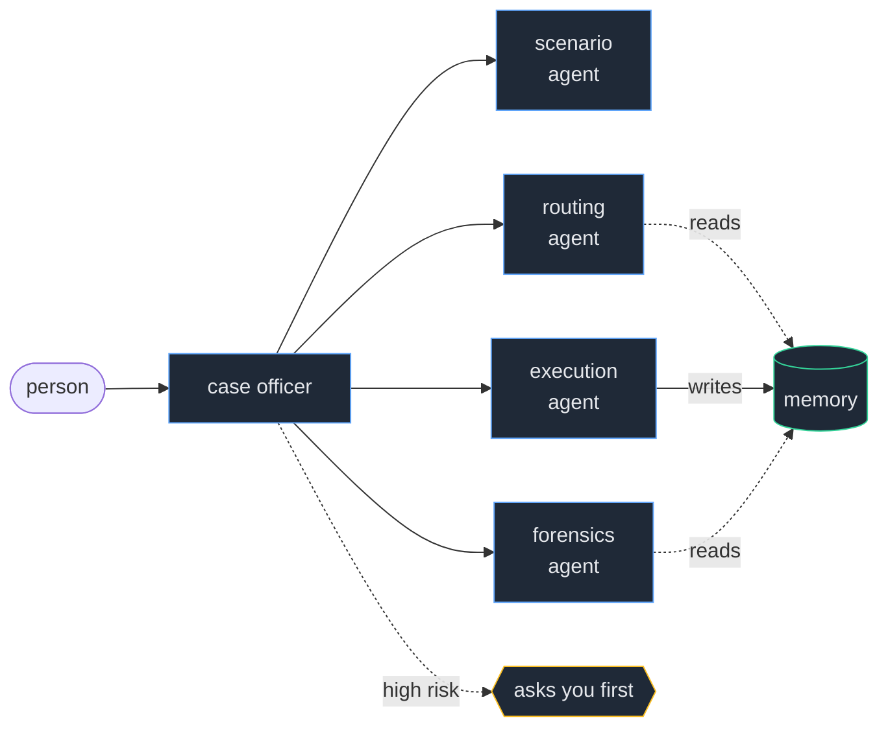

# TBI

**Tokens Bureau of Investigation.** Your AI spending, investigated.

---

You have four AI tabs open right now.

This morning you asked one of them where a supplier order got to. You sent that
to the most expensive model you own, because that tab was already open.

Nobody decides to do that. It just happens, thirty times a day.

### The number that should bother you

> **7% of your requests spend 59% of your money.**

The gap between the cheapest model and the most expensive is about **285x**.

So your bill is not decided by how much you use it. It is decided by how often
you reach for the wrong thing on the few requests that are expensive.

You cannot see which ones those were. Nobody can.

---

## What TBI does

**Every request is a case.**

| | |
|---|---|
| **Reads it** | before routing it anywhere |
| **Routes it** | to the model the work actually needs |
| **Records it** | real token cost, from the provider, never estimated |
| **Asks you** | now and then, whether the answer was any good |
| **Learns** | say no once and that kind of work moves up a tier for good |
| **Investigates** | flags the week your spending changed shape, and why |

After a month you have something no billing dashboard gives you.

Not what you spent. **Whether you spent it on the right things.**

---

## The team

Five agents. Four do the work, one runs the case.



| Agent | Job |
|---|---|
| **scenario** | reads the request. Intent, complexity, risk, domain |
| **routing** | picks the tier, using what you thought of past answers |
| **execution** | does the work, records what it really cost |
| **forensics** | reviews your spending, speaks only when it matters |

It runs in the background and **only surfaces when there is a real decision to
make.** Full diagrams in [ARCHITECTURE.md](ARCHITECTURE.md).

---

## Show me the arithmetic

One working day for a small business owner. Every number below comes from this
table, so you can check it yourself.

| Work | Per day | In | Out | Tier |
|---|---:|---:|---:|---|
| supplier and customer email | 12 | 250 | 200 | cheap |
| social post and product copy | 5 | 200 | 250 | cheap |
| meeting notes summary | 3 | 1800 | 300 | cheap |
| spreadsheet and formula help | 3 | 600 | 400 | mid |
| code and debugging | 3 | 900 | 700 | mid |
| supplier or pricing negotiation | 1 | 1200 | 900 | heavy |
| strategy or finance decision | 0.5 | 2000 | 1500 | max |

**27.5 tasks. 25,600 tokens.** By volume: 54% cheap, 30% mid, 8% heavy, 7% max.

That last 7% is the 59%.

Routed properly the day costs **$0.0809**, or **$2.43 a month**.

Now the same day done by hand, drifting to the habitual expensive model some of
the time:

| Drift | Per month | TBI saves |
|---:|---:|---:|
| never | $2.43 | **0%** |
| 20% | $5.76 | **58%** |
| 40% | $9.09 | **73%** |
| 60% | $12.42 | **80%** |

Read the first row. **Against somebody with perfect routing discipline, TBI
saves nothing on cost.** That is worth saying out loud. It is also not a real
person, and that row only counts money.

---

## The models

| Tier | Model | Gets |
|---|---|---|
| cheap | `amazon.nova-micro-v1:0` | email, captions, translation, summaries |
| mid | `anthropic.claude-haiku-4-5` | code, analysis, spreadsheets, the default |
| heavy | `anthropic.claude-sonnet-5` | strategy, legal, audit, forecasting |
| max | `anthropic.claude-fable-5` | decisions that cannot be undone |

**Mistakes are not symmetric.** A big model on easy work wastes a fraction of a
cent. A small model on hard work gives you a confident wrong answer that you act
on, and no ledger records that.

So `cheap` has to be earned, `mid` is the fallback, and **nothing reaches the top
tier by accident.** A parse failure can never become an expensive call.

Prices live in `src/config.py`. They are first party rates and Bedrock bills
separately, so check them before quoting anything.

---

## Run it

```bash
uv sync
```

```bash
USE_AWS=true python main.py
```

Add `DDB_TABLE=tbi` to store on DynamoDB instead of a local file. Nothing above
that line changes.

---

## Where it stands

Honest, because you will find out anyway.

| | |
|---|---|
| **Written and checked** | the agent team, routing, cost accounting, the ratings loop, anomaly detection |
| **Written, never connected** | the DynamoDB backend |
| **Not started** | the dashboard, and the demo video |
| **Never run against a live model** | all of it |

---

## Layout

| File | Job |
|---|---|
| `src/agents.py` | **the team.** Scenario, routing, execution, forensics, case officer |
| `src/forensics.py` | the forensics agent and its four tools |
| `src/router.py` | picks a tier. One call, keyword fallback, cached |
| `src/provider.py` | calls a model, returns what it really cost |
| `src/memory.py` | spend, ratings, history, anomalies |
| `src/pipeline.py` | the fast path, no agent overhead |
| `src/config.py` | the tier ladder and the prices |

**No number in the ledger is estimated by a model.** Every token count comes
from the provider's own usage response, which is the only reason any figure here
is worth showing anyone.
