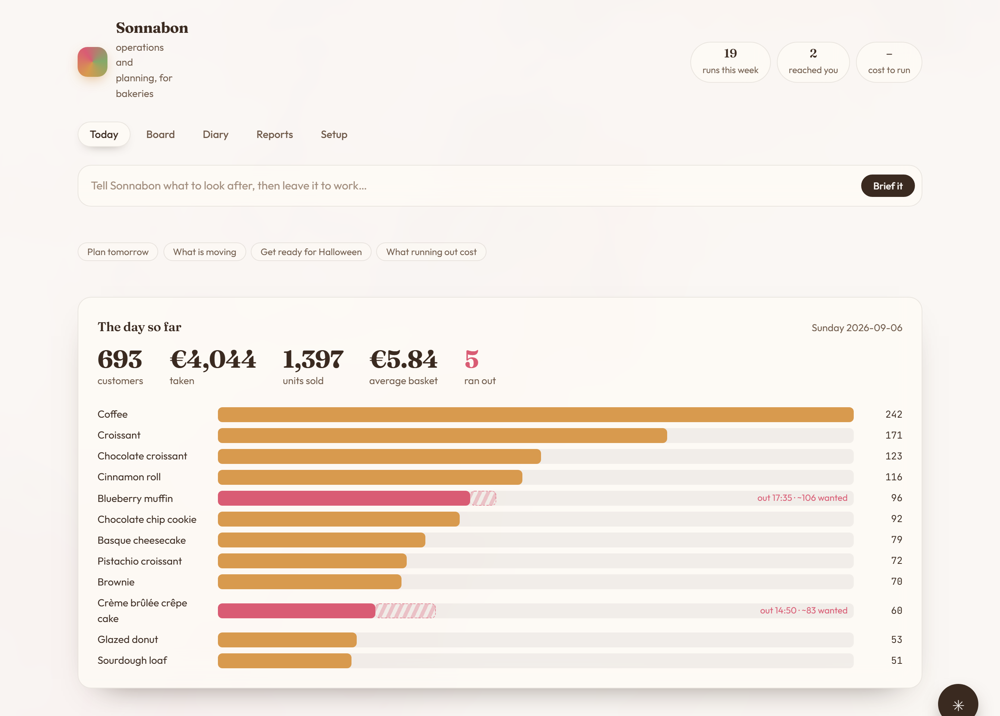
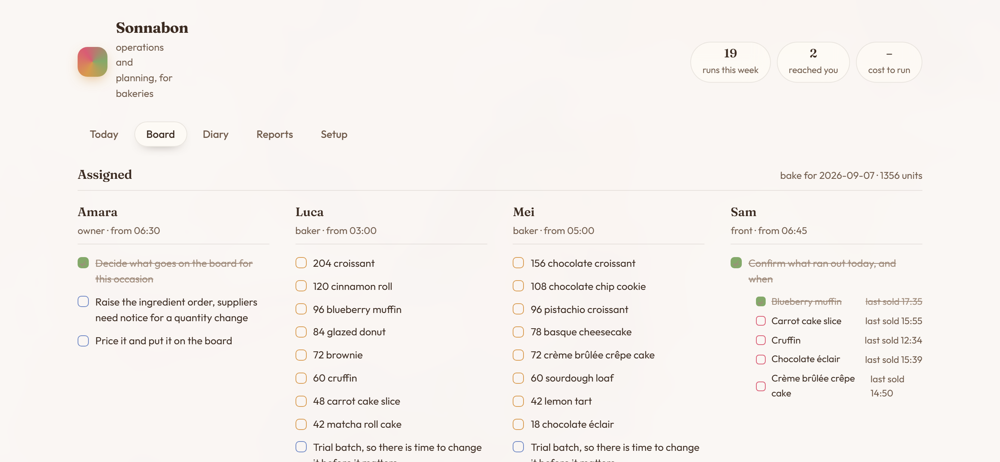

# Sonnabon

**The operations and planning manager a small bakery cannot afford to hire.**

One [Strands](https://strandsagents.com) agent. Point it at the till once. From
then on it decides tomorrow's production, orders the ingredients, holds the
calendar, and emails the owner only when something genuinely needs a person.



---

## The problem

Thirty products. Every night. From memory, at the end of a seventeen hour day.
Then four suppliers who each want their order by a different hour.

Nobody gets good at it, because there is never an hour to sit down with the
numbers. A small bakery keeps **4 to 9%** of what it earns and throws away
**10 to 15%** of what it makes. The planning never happens at all, because a
shop deciding tonight's bake at 20:40 is not also thinking about Halloween.

## The thing a till cannot tell you

> **Your best days are your worst days.**

Sell 60 cheesecakes by 13:46 and the till records a triumph. Nobody counts the
people who found an empty tray and left.

Every sell-out undercounts demand. Anything trained on that data learns to
under-bake for ever, settling on the shop's worst day.

**The timestamps give it away.** A product that stops selling dead while
everything else keeps going has run out, and that is provable from data the shop
already has. Sonnabon learns each product's normal shape through the day from
days it did not run out, then on a day it did, works out how far through that
shape it got and scales up.

Everything downstream reads that corrected history. Never the raw sales.

## What it does

| | |
|---|---|
| **Every evening** | Reads the day, decides tomorrow's production, gives each person their own list |
| **Per supplier cutoff** | Works back to ingredients and raises the orders |
| **Every week** | Says what is growing and what is dying, and refuses to call it when the movement is noise |
| **Weeks ahead** | Holds the occasion calendar, so Christmas arrives with the flour already ordered |
| **Rarely** | Emails the owner, when something actually needs deciding |

**About twenty runs a week. One or two reach the owner.** That ratio is the
product.



The board splits the night's work by who starts when. The person on the counter
gets one job: confirm what ran out. Sonnabon inferred it from the timestamps and
says so; only somebody standing there can settle it, and their tick makes the
next forecast better.

## Measured, not claimed

The shop in `data/` is generated, and that is the point. **No real till can say
how many people wanted something and left**, so no real dataset can score a
sell-out estimate. Here demand is known, because it was generated first and then
served out of a limited tray.

| | |
|---|---|
| Sell-out detection | **87%** precision, 74% recall |
| Demand estimate | **3.4%** median error, within 20% on 97% of days |
| Lost margin over a year | Estimated 28,113 against a true 29,700 |
| History needed | **Three weeks.** 90% precision on 18 trading days |
| Counterfactual, 120 days | **Lost sales cut 53%**, net cost down 7.7% |

```bash
python -m src.bakery.backtest    # replays the year and prices both plans
pytest                           # 41 tests, 19 seconds
```

The counterfactual is worth reading in full. Sonnabon's waste goes **up** and its
lost sales go **down by more than half**, because running out costs more than
binning does. That is the newsvendor doing what it should, and it is visible in
the numbers rather than asserted.

## Run it

```bash
pip install -e .
python ui/app.py
```

Open <http://localhost:8000>. The first start generates a year and corrects it,
about thirty seconds. Every start after that is instant.

## How it is built

```
src/bakery/
  receipts.py    bills, exactly as a till prints them
  catalogue.py   the menu, learned from the receipts themselves
  generate.py    a year of trade, sell-outs on purpose, truth kept aside
  analytics.py   sell-out detection, demand estimation, trends, rankings
  plan.py        corrected history, forecast, production quantities
  calendar.py    occasions, and how far ahead each has to be started
  team.py        whose job is what, and who confirms what ran out
  tickets.py     which jobs are done
  backtest.py    would it actually have done better
  tools.py       the twelve things the agent can do
  agent.py       the agent, and the limits it cannot argue with
  runs.py        what happens when the clock goes off
ui/
  app.py         the demo server
  index.html     five pages, one file, no build step
```

**The limits are hooks, not prompt text.** A ceiling written into a system
prompt is a request a model can talk itself out of. A hook that sets
`event.cancel` inside the agent loop is a control. Spend, looping and
irreversible actions are all gated that way.

**The agent never sees a bill.** There are 197,000 of them. Reading them once
would cost more than the waste it is preventing, and would not fit in context.
Tools return tens of numbers, not thousands of rows, and `run_python` handles
anything the tools do not cover.

## Pointing it at a real shop

Nothing is hard-coded to the demo bakery.

`catalogue.learn(bills)` derives the menu from the receipts. Names and prices
come straight off the bill lines, because a till already knows both.

The one thing a receipt cannot say is what an item cost to make. That comes from
a single number the owner gives once, and applied to everything it makes every
product identical, which is wrong. So Sonnabon tracks which costs it guessed and
asks about those. **That list is the whole setup conversation:** a few questions
the data actually raised, rather than a form.

Currency, data paths and limits are all environment variables. See
[`.env.example`](.env.example).

## What is honest about it

- The shop is simulated. Stated everywhere, and it is why the numbers above can
  exist at all.
- The backtest's corrections are learned from the whole file, so a little future
  leaks into the past. The forecasts themselves only read days before the one
  they plan. The tool prints this caveat rather than burying it.
- Web search returns "not configured" without an API key instead of inventing an
  event.
- Purchase orders and emails go to `data/outbox.jsonl` until SES is set up.

## Licence

MIT.
