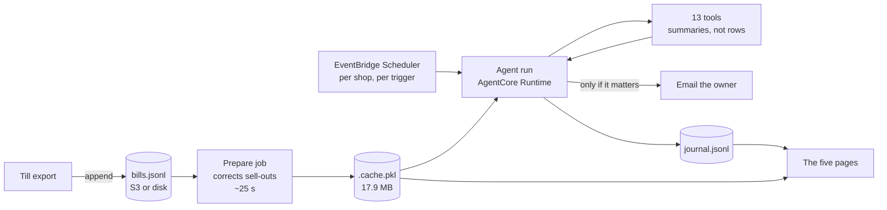

# How Sonnabon actually runs

Measured on the demo shop: 149,384 bills, 318 trading days, 25 MB of receipts.

| | |
|---|---|
| Cold build, receipts to corrected history | 24.9 s |
| Warm read, from the cache | 0.90 s |
| Resident memory, one shop | 113 MB, peaking at 220 MB during the build |
| Cache on disk | 17.9 MB |

Those four numbers decide almost everything below.

## One process, one bakery

The catalogue, the loaded shop and the feed are module level. That is the right
shape for one shop and a silent disaster for two: the second bakery would read
the first one's menu and plan against it, and nothing about that failure looks
like a failure. It would surface as somebody's production numbers being quietly
wrong.

So it is asserted rather than hoped for. `paths.only()` refuses a second shop in
the same process, and every store hangs off one `SHOP_ID`.

```
SHOP_ID=rue-des-lilas  DATA_ROOT=/srv/shops

/srv/shops/rue-des-lilas/
  bills.jsonl      the till's own export, appended to, never rewritten
  .cache.pkl       corrected history, keyed on the bills file's mtime
  journal.jsonl    every waking, and whether it reached the owner
  tickets.json     what the team has ticked off
  outbox.jsonl     what it sent, until SES is wired
  costs.json       the costs the owner confirmed
```

Isolation is the process boundary, not a tenant column in a query. One container
per shop, no shared mutable state, and a bug in one shop's data cannot reach
another's. Any single store can still be pointed elsewhere: `BILLS_FILE=s3://...`
wins over the derived path, so the receipts can live in object storage while the
rest stays local.

## The expensive part is never in the request path

24.9 seconds is fatal in a request and fine in a scheduled job. So the build runs
on a schedule and writes the cache; every run and every page read reads it in
under a second.



The cache is keyed on the bills file's modification time, so a stale cache is
impossible rather than unlikely: new bills change the mtime, the key misses, and
the build reruns. There is no invalidation step anyone can forget.

## What makes it autonomous, and what stops it

Autonomy is a scheduler and a set of triggers, not a loop that never ends.

| Trigger | What fires | Reads |
|---|---|---|
| Close of trade | `runs.nightly` | today's bills, the corrected history |
| Each supplier cutoff | the ordering step | tomorrow's plan |
| Sunday evening | `runs.weekly` | trends, the occasion calendar |
| On demand | whatever was asked | whatever the question needs |

Three limits sit inside the SDK's own loop as hooks that set `event.cancel`.
A limit written into a system prompt is a request, and a model can talk itself
out of a request.

- **Calls.** Thirty tool calls means it is looping, not working.
- **Spend.** More than a few cents in one run means something went wrong.
- **Actions.** Sending an order or an email is not something to do twice.

The third is the one that matters for autonomy. Because it is counted from the
tools actually run rather than from what the closing paragraph claims, an agent
that says it emailed you and did not is caught.

## Running twice must be safe

A scheduler retries. A container restarts. Neither may produce two emails.

The journal is the idempotency record: each entry can carry a `key`, and
`journal.already_said(key)` is checked before raising anything. An overdue
supplier order is keyed on the occasion and its due date, so it is raised once
and then left alone. That is not only a retry guard, it is the behaviour that
keeps the agent from nagging: without it, a task that stays overdue produces an
email every night until somebody does it.

The same record is what the front page counts. `runs this week` and `reached
you` are read from the journal, never asserted, and rendering a page is
explicitly not a waking.

## The arithmetic that decides the tool design

There are 149,384 bills. What the agent may read is settled by cost, not taste.

| Reading | Tokens | Cost per read |
|---|---|---|
| One day, raw | 31,000 | $0.09 |
| One week, raw | 196,000 | $0.59, and past the context window |
| One week, summarised | 4,000 | $0.01 |

So tools return tens of numbers rather than thousands of rows. When a summary is
not enough, `sample_bills` returns fifteen real receipts for about 200 tokens.
When the question genuinely needs every bill, `run_python` runs over all of them
and returns the answer instead of the data.

This is why the cost per shop stays flat however long the shop has been trading.
A shop with five years of history costs the same per run as one with three
weeks, because neither ever sends the pile.

## Scaling to many shops

Nothing is kept warm. A shop is a schedule and a directory.

- **Cost per shop is bounded by the run, not by the data.** Two scheduled runs a
  day, tens of thousands of tokens each.
- **Memory is 113 MB for the duration of a run**, not continuously. Between runs
  a shop costs storage only: 25 MB of receipts and a 17.9 MB cache.
- **The prepare job is the only heavy thing**, and it is embarrassingly
  parallel: one shop, one job, no coordination.
- **Adding a shop is a directory and two schedule entries.** There is no
  migration and no shared table to grow.

The thing that would break first is the prepare job if a shop's history grew
past what fits in memory. At 318 days it is 113 MB, so the ceiling is somewhere
around a decade of trade, and the fix when it arrives is to correct a rolling
window rather than the whole file. The forecast only reads six weeks back, so
nothing downstream would notice.

## What is deliberately not built

Being honest about the edges is cheaper than discovering them on stage.

- **No queue.** Runs are scheduled and idempotent, so a retry is safe and a
  missed run is picked up by the next one. A queue would add a failure mode to
  buy ordering that nothing here needs.
- **No database.** The till's export is the source of truth and it is append
  only. A database would be a second copy to keep in step with it.
- **No shared cache between shops.** Each shop's corrected history is derived
  from its own receipts and is useless to any other.
- **No streaming ingestion.** Bills arrive in a file that gets appended to.
  `feed.since(offset)` seeks straight to the byte and reads forward, so a live
  read costs the same whether a week or a decade sits behind it.
